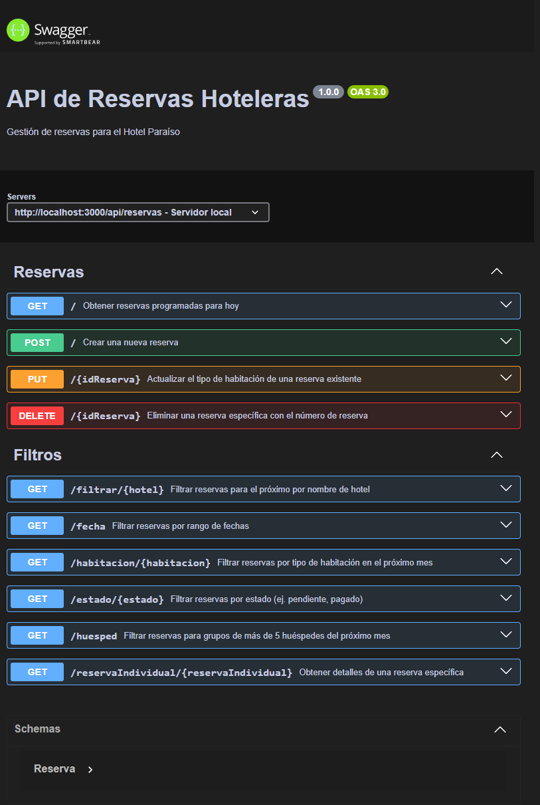

# Proyecto 4 - API de Reservas Hoteleras (Hotel Paraíso)

El **Proyecto N° 4**, es una aplicación Express que simula una lista de reservas para el **hotel Paraíso** mediante una API con las siguientes funcionalidades:

**Swagger**  
Documentación disponible para usar las APIs en:  
**http://localhost:3000/api-docs**



---

**Ruta base**  
**http://localhost:3000**

---

## Endpoints disponibles

**Obtener reservas**  
**Método GET** `/api/reservas`

- Como gerente del hotel, quiero ver una lista de todas las reservas para hoy para poder planificar el trabajo del personal de limpieza y recepción.

  **Body:**

  ```
  {
      "mensaje": "Reserva programadas para hoy",
      "reservas": [
          {
              "id": "e6873dbb-7e10-45a5-bf5e-53b107858bdf",
              "hotel": "Hotel Paraíso",
              "reservas": 12345,
              "fecha_inicio": "2025-07-15",
              "fecha_fin": "2025-08-20",
              "tipo_habitacion": "doble",
              "huesped_adultos": 3,
              "huesped_ninos": 3,
              "num_huespedes": 6,
              "estado": "pagado"
          },
          {
              "id": "514eecf5-64ee-4751-a919-27391181b4f1",
              "hotel": "Hotel Paraíso",
              "reservas": 12346,
              "fecha_inicio": "2025-07-15",
              "fecha_fin": "2025-07-20",
              "tipo_habitacion": "doble",
              "huesped_adultos": 2,
              "huesped_ninos": 2,
              "num_huespedes": 4,
              "estado": "pendiente"
          }
      ]
  }
  ```

---

**Crear reserva**  
**Método POST** `/api/reservas`

- Como viajero, quiero hacer una reserva en el hotel "Hotel Paraíso" para el 15 de julio de 2025. Necesito una habitación doble para dos adultos y un niño.

  **Body:**

  ```
  {
      "mensaje": "Reserva creada con éxito",
      "nueva": {
          "id": "e6873dbb-7e10-45a5-bf5e-53b107858bdf",
          "hotel": "Hotel Paraíso",
          "reservas": 12345,
          "fecha_inicio": "2025-07-15",
          "fecha_fin": "2025-08-20",
          "tipo_habitacion": "doble",
          "huesped_adultos": 3,
          "huesped_ninos": 3,
          "num_huespedes": 6,
          "estado": "pagado"
      }
  }
  ```

---

**Modificar reserva**  
**Método PUT** `/api/reservas/12345`

- Como huésped, necesito cambiar mi reserva en el hotel "Hotel Paraíso". Originalmente reservé una habitación doble, pero ahora necesito una **>suite familiar**. Mi número de reserva es 12345.

  **Body:**

  ```
  {
      "mensaje": "Reserva actualizada con éxito",
      "reservas": {
          "id": "e6873dbb-7e10-45a5-bf5e-53b107858bdf",
          "hotel": "Hotel Paraíso",
          "reservas": 12345,
          "fecha_inicio": "2025-07-15",
          "fecha_fin": "2025-08-20",
          "tipo_habitacion": "suite familiar",
          "huesped_adultos": 3,
          "huesped_ninos": 3,
          "num_huespedes": 6,
          "estado": "pagado"
      }
  }
  ```

---

**Borrar reserva**  
**Método DELETE** `/api/reservas/12345`

- Como viajero, tuve un cambio de planes y ya no necesito la habitación que reservé en el hotel "Hotel Paraíso". Mi número de reserva es 12345.

  **Body:**

  ```
  {
      "mensaje": "La reserva fue eliminada con éxito",
      "reservas": {
          "id": "e6873dbb-7e10-45a5-bf5e-53b107858bdf",
          "hotel": "Hotel Paraíso",
          "reservas": 12345,
          "fecha_inicio": "2025-07-15",
          "fecha_fin": "2025-08-20",
          "tipo_habitacion": "suite familiar",
          "huesped_adultos": 3,
          "huesped_ninos": 3,
          "num_huespedes": 6,
          "estado": "pagado"
      }
  }

  ```

---

**Filtrar reservas por hotel**  
**Método GET** `/api/reservas/filtrar/Hotel Paraíso`

- Como gerente de una cadena de hoteles, quiero ver todas las reservas para el "Hotel Paraíso" para el próximo mes.

  **Body:**

  ```
  {
      "mensaje": "Reserva encontradas para el próximo mes",
      "reservas": [
          {
              "id": "b6e968c8-fcca-42b2-a539-d03f9436d2ed",
              "hotel": "Hotel Paraíso",
              "reservas": 12345,
              "fecha_inicio": "2025-07-15",
              "fecha_fin": "2025-07-20",
              "tipo_habitacion": "doble",
              "huesped_adultos": 3,
              "huesped_ninos": 3,
              "num_huespedes": 6,
              "estado": "pagado"
          },
          {
              "id": "514eecf5-64ee-4751-a919-27391181b4f1",
              "hotel": "Hotel Paraíso",
              "reservas": 12346,
              "fecha_inicio": "2025-07-15",
              "fecha_fin": "2025-07-20",
              "tipo_habitacion": "doble",
              "huesped_adultos": 2,
              "huesped_ninos": 2,
              "num_huespedes": 4,
              "estado": "pendiente"
          }
      ]
  }

  ```

---

**Filtrar reservas por rango de fechas**  
**Método GET** `/api/reservas/fecha?fecha_inicio=2025-07-20&fecha_fin=2025-07-30`

- Como gerente del hotel, quiero ver todas las reservas para la semana de Navidad para poder planificar el personal y las actividades necesarias.

  **Body:**

  ```
  {
      "mensaje": "Reservas encontradas en el rango de fechas",
      "reservas": [
          {
              "id": "514eecf5-64ee-4751-a919-27391181b4f1",
              "hotel": "Hotel Paraíso",
              "reservas": 12346,
              "fecha_inicio": "2025-12-22",
              "fecha_fin": "2025-12-28",
              "tipo_habitacion": "doble",
              "huesped_adultos": 2,
              "huesped_ninos": 1,
              "num_huespedes": 3,
              "estado": "pendiente"
          }
      ]
  }
  ```

---

**Filtrar reservas por tipo de habitación**  
**Método GET** `/api/reservas/habitacion/individual`

- Como gerente del hotel, quiero ver todas las reservas para nuestras **suites de lujo** para el próximo mes para asegurarme de que todo esté en perfectas condiciones para nuestros huéspedes VIP.

  **Body:**

  ```
  {
      "mensaje": "Reservas encontradas según tipo de habitación",
      "reservas": [
          {
              "id": "84e5d484-2bfd-4c98-95a9-430589761fc7",
              "hotel": "Hotel Paraíso",
              "reservas": 12348,
              "fecha_inicio": "2025-08-14",
              "fecha_fin": "2025-08-20",
              "tipo_habitacion": "suites de lujo",
              "huesped_adultos": 3,
              "huesped_ninos": 3,
              "num_huespedes": 6,
              "estado": "pendiente"
          }
      ]
  }

  ```

---

Filtrar reservas por estado
**Método GET** `/api/reservas/estado/pendiente`

- Como gerente del hotel, quiero ver todas las reservas que están pendientes de pago para poder hacer un seguimiento con los clientes.

  **Body:**

  ```
  {
      "mensaje": "Reservas encontradas según tipo de estado",
      "reservas": [
          {
              "id": "84e5d484-2bfd-4c98-95a9-430589761fc7",
              "hotel": "Hotel Paraíso",
              "reservas": 12348,
              "fecha_inicio": "2025-08-14",
              "fecha_fin": "2025-08-20",
              "tipo_habitacion": "suites de lujo",
              "huesped_adultos": 3,
              "huesped_ninos": 3,
              "num_huespedes": 6,
              "estado": "pendiente"
          },
          {
              "id": "514eecf5-64ee-4751-a919-27391181b4f1",
              "hotel": "Hotel Paraíso",
              "reservas": 12346,
              "fecha_inicio": "2025-12-22",
              "fecha_fin": "2025-12-28",
              "tipo_habitacion": "doble",
              "huesped_adultos": 2,
              "huesped_ninos": 1,
              "num_huespedes": 3,
              "estado": "pendiente"
          }
      ]
  }
  ```

---

**Filtrar reservas por número de huéspedes**  
**Método GET** `/api/reservas/huesped`

- Como gerente del hotel, quiero ver todas las reservas para grupos de más de **5 personas** para el próximo mes, para poder planificar las necesidades adicionales de estos grupos grandes.

  **Body:**

  ```
  {
      "mensaje": "Reservas encontradas con más de 5 huéspedes",
      "reservas": [
          {
              "id": "84e5d484-2bfd-4c98-95a9-430589761fc7",
              "hotel": "Hotel Paraíso",
              "reservas": 12348,
              "fecha_inicio": "2025-08-14",
              "fecha_fin": "2025-08-20",
              "tipo_habitacion": "suites de lujo",
              "huesped_adultos": 3,
              "huesped_ninos": 3,
              "num_huespedes": 6,
              "estado": "pendiente"
          },
          {
              "id": "e26b927d-fbd2-4190-b1d2-d8d7bd7bf342",
              "hotel": "Hotel Paraíso",
              "reservas": 12350,
              "fecha_inicio": "2025-08-14",
              "fecha_fin": "2025-08-20",
              "tipo_habitacion": "familiar",
              "huesped_adultos": 3,
              "huesped_ninos": 3,
              "num_huespedes": 6,
              "estado": "pagado"
          }
      ]
  }
  ```

---

**Filtrar reservas individual**  
**Método GET** `/api/reservas/reservaIndividual/12345`

- Como recepcionista, necesito verificar los detalles de la reserva del huésped que acaba de llegar al hotel. Su número de reserva es 12345.

  **Body:**

  ```
  {
      "mensaje": "Reserva encontrada",
      "reservas": {
          "id": "e6873dbb-7e10-45a5-bf5e-53b107858bdf",
          "hotel": "Hotel Paraíso",
          "reservas": 12345,
          "fecha_inicio": "2025-07-15",
          "fecha_fin": "2025-08-20",
          "tipo_habitacion": "doble",
          "huesped_adultos": 3,
          "huesped_ninos": 3,
          "num_huespedes": 6,
          "estado": "pagado"
      }
  }
  ```
